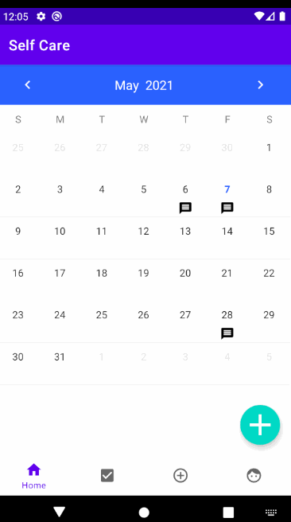

# selfcare-app
Original App Design Project - README Template
===

# Self-Care Reminders

## Table of Contents
1. [Overview](#Overview)
1. [Product Spec](#Product-Spec)
1. [Wireframes](#Wireframes)
2. [Schema](#Schema)

## Overview
### Description
A self-care reminder app. It reminds users to stretch, drink water, to have good posture.

### App Evaluation
[Evaluation of your app across the following attributes]
- **Category:**
    - Health
- **Mobile:**
    - Mobile
- **Story:**
    - Medication, posture, water drinking, stretches
- **Market:**
    - Anyone that routinely forgets to complete simple tasks to take care of themselves can use the app as a reminder of these tasks.
- **Habit:**
    - Daily use
- **Scope:**
    - Allow users to input tasks/mark them off as completed daily

## Product Spec

### 1. User Stories (Required and Optional)

**Required Must-have Stories**

- [x] Notify users based on created reminders
- [x] Allow users to input custom tasks 
- [x] Implement timer for each task
- [x] Preset list of stretches
* Show how much time is left on the timer per task

**Optional Nice-to-have Stories**

* Create presets for a set of tasks
* Daily log-in bonus / Mark how often user uses app (point system)
* Use points towards little characters/icons

### 2. Screen Archetypes

- [x] Notify users about tasks (Stream)
-    [x] Notify users to stretch, drink water, posture
-    [x] Allow users to input custom tasks 
-    [x] Implement timer for each task
- [x] Calender/Scheduler (Profile/Detail)
-    [x] User can press on date to see what reminders are on that day
-    [x] Full calender view of month
- [x] Creating new tasks (Creation)
- [x] Name of task
- [x] Date/time
- [ ] Frequency (how often the timer goes off, if needed)
- [x] Extra notes
- [x] List of preset stretches

### 3. Navigation

**Tab Navigation** (Tab to Screen)

* Stream/Creation
* Calendar/Scheduler

**Flow Navigation** (Screen to Screen)

* Stream, notify users
   * Creation, allow users to input custom tasks
* Calendar
   * DetailActivity, how well the user is feeling on that day.
   * Certain reminders for the day

## Wireframes


### [BONUS] Digital Wireframes & Mockups

### [BONUS] Interactive Prototype

## Schema 
[This section will be completed in Unit 9]
### Models
#### Post

   | Property      | Type     | Description |
   | ------------- | -------- | ------------|
   | image         | File     | image that user posts |
   | caption       | String   | image caption by author |
   | tweet    | Tweet   | post a tweet to twitter API |
   | createdAt     | DateTime | date when post is created (default field) |
   | updatedAt     | DateTime | date when post is last updated (default field) |
   
#### Reminder

   | Property      | Type     | Description |
   | ------------- | -------- | ------------|
   | name         | String     | name of reminder |
   | type       | String   | image caption by author |
   | time       | DateTime   | time reminder will go off |
   | notes       | String   | additional notes |
   
#### Stretches
   | Property      | Type     | Description |
   | ------------- | -------- | ------------|
   | name         | String     | name of stretch |
   | image       | File   | image of stretch |
   | description       | String   | description of the stretch |
### Networking
#### List of network requests by screen
   - Create Post Screen
      - (Create/POST) Create a new tweet on a post
         ```swift
         public void publishTweet(String tweetContent, JsonHttpResponseHandler handler) {
		String apiUrl = getApiUrl("statuses/update.json");
		// Can specify query string params directly or through RequestParams.
		RequestParams params = new RequestParams();
		params.put("status", tweetContent);
		client.post(apiUrl, params, "", handler);
	    }
         ```
- [OPTIONAL: List endpoints if using existing API such as Yelp]
| HTTP Verb      | Endpoint     | Description |
   | ------------- | -------- | ------------|
   | `POST`         | statuses/update     | updates the authenticating user's current status, also known as tweeting. |
   | `GET`       | oauth/authenticate   | Allows a Consumer application to use an OAuth request_token to request user authorization.| |
   
#### Walkthrough Sprint 1


#### Walkthrough Sprint 2


#### Walkthrough Sprint 3


#### Walkthrough Sprint 4


#### Full App Walkthrough

